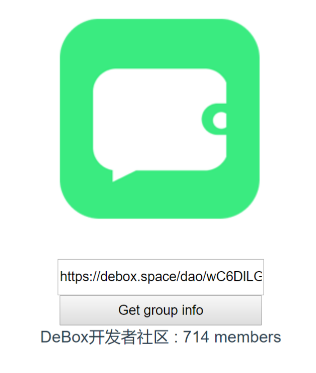

# A Simple DeBox API Example

**English** | [中文](./README.zh_CN.md)

## Setting up the Vue Project

### Overview

1. Modify vue.config.js to handle cross-origin requests.
2. Create an API endpoint to fetch Group information and configure the API-Key. 
3. Add an input field on the frontend page to receive the 'group_invite_url' parameter.
4. Add a button on the frontend page to trigger the API call and fetch the Group information.


### Getting Started

1. Replace the API-Key in getGroupInfo.js.

2. Start the project:
```
npm run serve
```

3. Once the page is open, enter any Group's sharing link in the input field. You can use this link for testing 
```
https://debox.space/dao/wC6DlLGJ 
```


4. After entering the link, click the button, and a panel will pop up displaying the Group's information.



### Join our official developer community and participate in ecosystem development!！
 [Click to Join](https://debox.space/dao/wC6DlLGJ)


